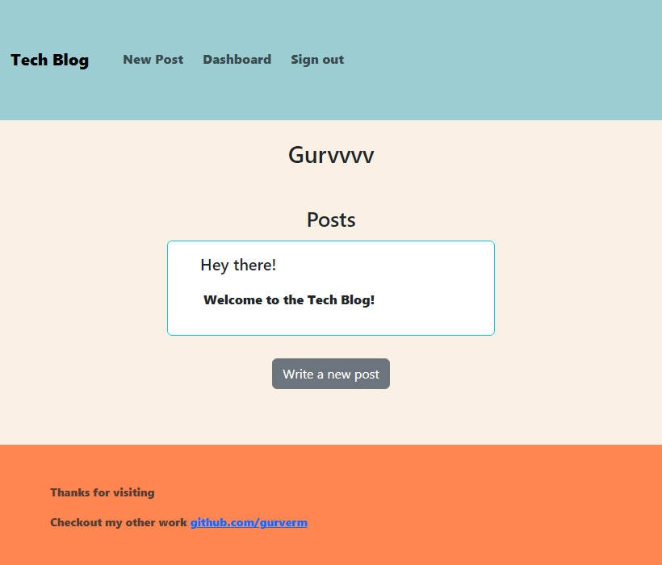

# Tech Blog
   

## Description
A place CSM-style blog site where users can write about tech to share open for others to comment on.

## Table of Contents
1. [Installation](#installation)
2. [Usage](#usage)
3. [Contributions](#contributions)
4. [Tests](#tests)
5. [License](#license)
6. [Questions](#questions)

## Installation
Visit the deployed application: 

If you want to run it locally clone this repository. Then sign into mysql through the terminal and run 'source db/schema.db', to create the database. Next run 'npm install'. Lastly, run 'npm start' to get the application running on your localhost browser

## Usage

## License
This project is licensed under mit 
https://opensource.org/licenses/MIT

## Questions
If you have any additional questions regarding this project please contact me at maduraigurveer@gmail.com.
You can view more of my work at https://github.com/gurverm